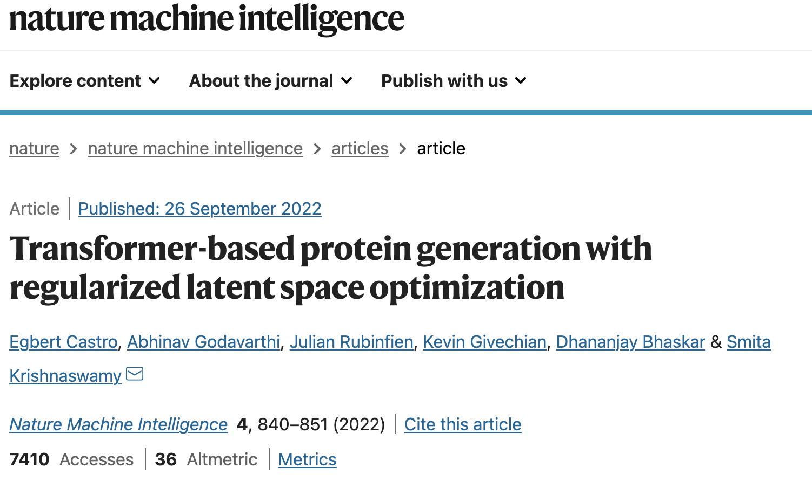
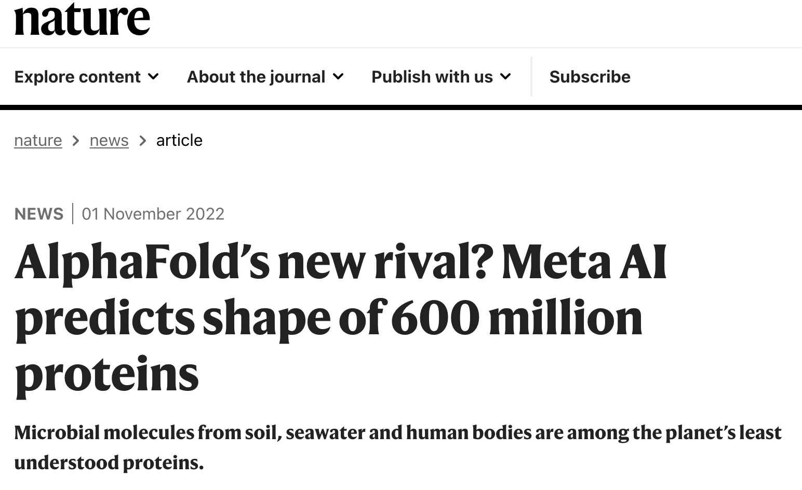
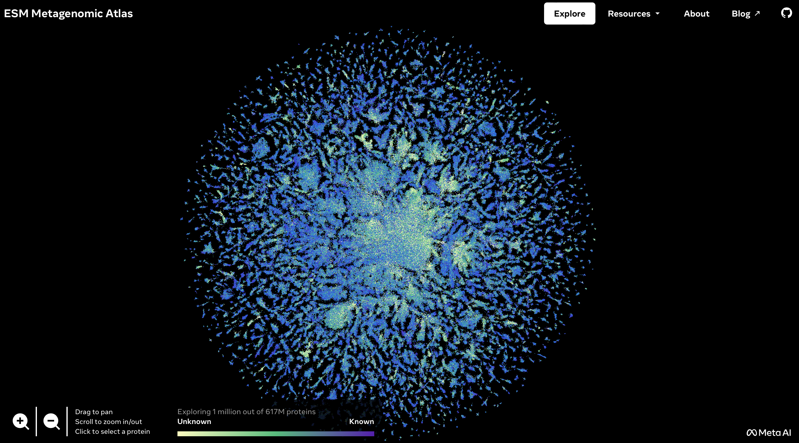
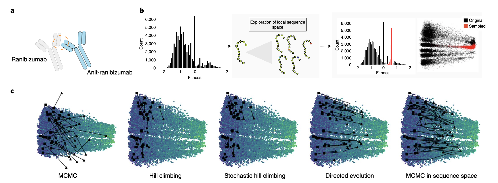
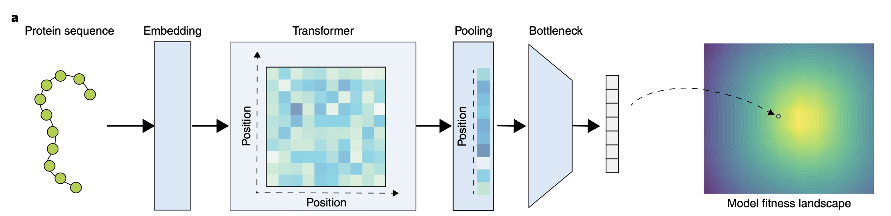
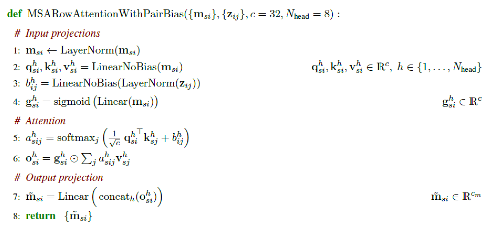

# Paper review on ReLSO protein sequence generation and ESM2 summary

This repo server as the paper ReLSO analysis primarily and ESM analysis for the data science presentation. 



The ReLSO model are used to combined both sequence generation task (for protein design) and protein function prediction task (for designed protein sequnece  evaluation)

## Overview

### Relevant work

#### [TAPE:Evaluating Protein Transfer Learning with TAPE (https://github.com/Yijia-Xiao/ProteinLM)](https://github.com/songlab-cal/tape/blob/6d345c2b2bbf52cd32cf179325c222afd92aec7e/tape/models/modeling_utils.py#L843)
The first Semi-supervised learning use in protein function prediction and protein structure prediction. The semi-supervised method help lower down the cost of acquiring supervised protein labels. To facilitate progress in this field, Yun s Song et. al.[[1]](#1) introduce the Tasks Assessing Protein Embeddings (TAPE), a set of five biologically relevant semi-supervised learning tasks spread across different domains of protein biology, such as stability, secondary structure prediction, binding affinity prediction etc.

#### [ProteinGAN: A generative adversarial network that generates functional protein sequences](https://github.com/Biomatter-Designs/ProteinGAN)
De novo protein design for catalysis of any desired chemical reaction is a long standing goal in protein engineering. ProteinGAN, a specialised variant of the generative adversarial network that is able to 'learn' natural protein sequence diversity and enables the generation of functional protein sequences. ProteinGAN learns the evolutionary relationships of protein sequences directly from the complex multidimensional amino acid sequence space and creates new, highly diverse sequence variants with natural-like physical properties. Using malate dehydrogenase as a template enzyme, they show that 24% of the ProteinGAN-generated and experimentally tested sequences are soluble and display wild-type level catalytic activity in the tested conditions in vitro, even in highly mutated (>100 mutations) sequences. ProteinGAN therefore demonstrates the potential of artificial intelligence to rapidly generate highly diverse novel functional proteins within the allowed biological constraints of the sequence space. However, it is really hard to convert while training. Therefore, it is hard to retrieve the high fitness protein sequences [[2]](#2)

#### [ESM: Evolutionary Scale Modeling](https://github.com/facebookresearch/esm)
This is a large protein language model used in current protein related downstreams tasks, which can be considered as GPT3 in biomolecules. However it does not contain the protein sequence design module or function prediction heads. The new release ESMFold can fast predict protein structure with single sequences in parallel. [[3]](#3)


### Summary: 
Currently most of the protein language model are using Transformer based methods to capture both local and global information. And then using the sequence representation to conduct other protein structure/function related tasks. However, there are not specific models for the DMS data. The model ReLSO, a deep transformer-based autoencoder, combined both language model and latent space gradient-based methods to generate funtion-enhanced protein sequences.


### ReLSO contributions [[4]](#4)
1. The model use transformer based encoder
2. The model construct sequence-function relationships 
3. The model re-normalize the convex latent space for better sequence optimization
4.  A gradient-ascent algorithm for generating new sequences from the latent space

#### [ReLSO architecture](https://github.com/KrishnaswamyLab/ReLSO-Guided-Generative-Protein-Design-using-Regularized-Transformers)


#### Training details

ReLSO were training on three different datasets TAPE, Gifford, GB1, repsectively. The sequence optimization is using gradient ascent.
1. Protein sequences are using one-hot embedding to convert into input
2. The latent space is regularized with KNN (k-nearest-neighbor)
3. The explain of the ReLSO are trained on Gifford which contain 60000+ sequence-enrichment datapoints. Sequences share one wild type sequence

#### Pseudocode:
##### Encoder Block:
**Input**: 𝒛 ∈ 𝑉*<sub>𝒛</sub>; protein sequence of amino acids; 𝒙 ∈ 𝑉*<sub>𝒙</sub>, amino acids token IDs.
**Output**: a ∈ R, where a indicate the desired values.
**Hyperparameters**: *l* Encoder Layers, *L*<sub>max</sub>, *C*<sub>s</sub> *=* 1024,*C*<sub>z</sub> *=* 128
* For *l* in range(*l*):
*  | p *<-* PositionEncoding(x)
*  | z *<-* z *+* RowMultiHeadSelfAttention(*z*)
*  | z *<-* LayerNorm(*z*)
*  | z *<-* z *+* Linear(*z*)
*  | z *<-* z *+* Linear(*z*)
* representation_z *<-* Bottleneck(z)
**End**

**Input**: 𝒛 ∈ 𝑉*<sub>𝒛</sub>; protein sequence of amino acids; 𝒙 ∈ 𝑉*<sub>𝒙</sub>, amino acids token IDs.
**Output**: a ∈ R, where a indicate the desired values.
**Hyperparameters**: *l* Layers, *L*<sub>max</sub>, *C*<sub>s</sub> *=* 1024,*C*<sub>z</sub> *=* 128.

##### Decoder Block:
* For *l* in range(*l*):
*  | z *<-* z *+* Linear(*z*)
*  | z *<-* z *+* conv(*z*) 
*  | z *<-* z *+* Dropout(*z*)
*  z *<-* Linear(z)
**End**

##### Regression Head:
*  z *<-* Linear(*z*)
*  z *<-* Linear(*z*)
**End**


##### ReLSO:
*l*<sub>z</sub> ← length(𝒛)
for x ∈ [*l*<sub>z</sub>] : 𝒆<sub>𝑡</sub> ←  One_hot(𝒛[𝑡]) + 𝑾<sub>𝒑</sub> [:, 𝑡]
𝑿 ← [𝒆<sub>1</sub>, 𝒆<sub>2</sub>, . . . 𝒆<sub>*l*</sub>]
* For *l* in range(*l*) do
* | *rep_Z* *<-* Encoder_Block(*X*)
* For *l* in range(*l*):
* | *Y* *<-* Decoder_Block(*rep_Z*)
* o *<-* Regression_Head(*Y*)
**End**


### ESM contributions:

*The model is trained on the entire protein sequences database.

#### psedocode:
#### RowMultiHeadSelfAttention:


### Datasets - different potential application
1. Gifford - anti-Ranibizumab binding affinity enhancing
2. Tape - general protein sequence representation.
3. GB1 - dataset for the IgG human antibody design

## Questions
### 1. Why do we need neural network in protein sequences?
### 2. Why does the transformer can help encode protein sequences?
### 3. Which area of models can also apply on biomolecule related task?

## Discussion
### Protein mutants design
The current sequence generative model are not able to train on different types of protein sequences, which limits generalization capability.

### Froce smooth
Froce smooth can make the sequence easier to trap in a local minima

### Single sequence structure prediction
The structure prediction questions are closed by AlphaFold2. But single sequence protein structure prediction task remains

### Protein sequence paradox
The "paradox" is that most small proteins fold on a millisecond or even microsecond time scale.

### Transformer vs CNN
The CNN might be reaching comparable preformance in protein structure prediction (TFold (200+ ResNet) vs RosetTAFold)

### protein-molecules complexes (protein-DNA, portein-RNA, protein-ligand, protein-protein, protein-peptide)


## References
<a id="1">[1]</a> TAPE
```bibtex
@article{rao2019evaluating,
  title={Evaluating protein transfer learning with TAPE},
  author={Rao, Roshan and Bhattacharya, Nicholas and Thomas, Neil and Duan, Yan and Chen, Peter and Canny, John and Abbeel, Pieter and Song, Yun},
  journal={Advances in neural information processing systems},
  volume={32},
  year={2019}
}
```
<a id="2">[2]</a> ProteinGAN
```bibtex
@article{repecka2021expanding,
  title={Expanding functional protein sequence spaces using generative adversarial networks},
  author={Repecka, Donatas and Jauniskis, Vykintas and Karpus, Laurynas and Rembeza, Elzbieta and Rokaitis, Irmantas and Zrimec, Jan and Poviloniene, Simona and Laurynenas, Audrius and Viknander, Sandra and Abuajwa, Wissam and others},
  journal={Nature Machine Intelligence},
  volume={3},
  number={4},
  pages={324--333},
  year={2021},
  publisher={Nature Publishing Group}
}
```

<a id="3">[3]</a> ESMFold
```bibtex
@article{lin2022language,
  title={Language models of protein sequences at the scale of evolution enable accurate structure prediction},
  author={Lin, Zeming and Akin, Halil and Rao, Roshan and Hie, Brian and Zhu, Zhongkai and Lu, Wenting and dos Santos Costa, Allan and Fazel-Zarandi, Maryam and Sercu, Tom and Candido, Sal and others},
  journal={bioRxiv},
  year={2022},
  publisher={Cold Spring Harbor Laboratory}
}
```


<a id="4">[4]</a> ReLSO
```bibtex
@article{castro2022transformer,
  title={Transformer-based protein generation with regularized latent space optimization},
  author={Castro, Egbert and Godavarthi, Abhinav and Rubinfien, Julian and Givechian, Kevin and Bhaskar, Dhananjay and Krishnaswamy, Smita},
  journal={Nature Machine Intelligence},
  volume={4},
  number={10},
  pages={840--851},
  year={2022},
  publisher={Nature Publishing Group}
}
```
